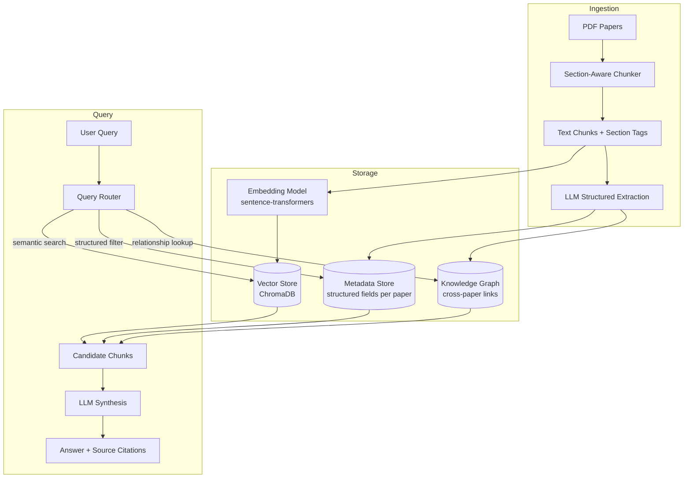
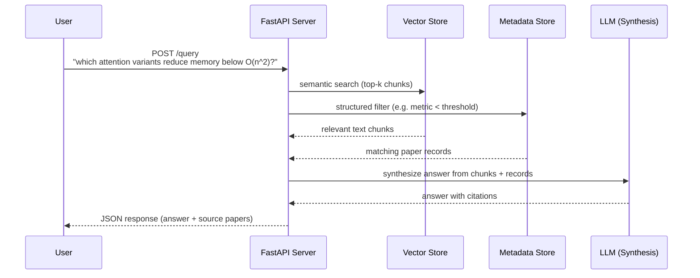
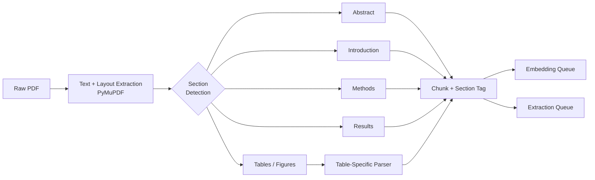
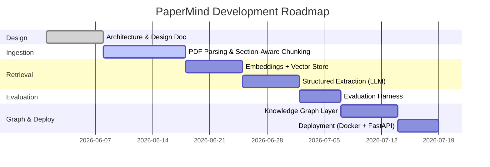

# PaperMind

**A research intelligence system for querying scientific literature with structured, cross-paper reasoning.**

---


## Architecture

The system is split into three stages: **ingestion** (turning PDFs into structured, searchable data), **storage** (a vector store for semantic search + a metadata store for structured facts), and **query** (combining both to answer questions with citations).



---

##  How a Query Flows Through the System



---

##  Ingestion Pipeline: Section-Aware Chunking

Naive RAG pipelines split documents into fixed-size token chunks (e.g. every 500 tokens). This breaks badly on scientific papers: a chunk boundary can land in the middle of a table, separate a result from the section that explains it, or split an equation from its surrounding context.

PaperMind's ingestion pipeline instead detects document structure first, and chunks *within* sections, so a chunk from the Methods section is tagged as Methods, a chunk from Results is tagged as Results, and tables/figures are parsed separately rather than mangled into plain text.



---

##  Core Components

| Component | Purpose | Planned Tech |
|---|---|---|
| **Ingestion Service** | Extract text/layout from PDFs, detect sections, chunk with metadata tags | PyMuPDF, custom chunker |
| **Embedding Service** | Generate dense vector representations of chunks | sentence-transformers |
| **Vector Store** | Semantic similarity search over chunks | ChromaDB |
| **Extraction Service** | Pull structured fields (materials, metrics, methods) from each paper via LLM | LLM API + Pydantic schemas |
| **Metadata Store** | Store structured per-paper records for filtering | SQLite / Postgres |
| **Knowledge Graph** | Link papers by shared materials, methods, citations | NetworkX (initial), Neo4j (later) |
| **Query API** | Route queries, combine retrieval results, synthesize answers | FastAPI |
| **Evaluation Harness** | Measure retrieval quality against a gold-standard query set | Custom (hit rate, MRR) |

---

##  Evaluation Plan

A RAG system that "seems to work" isn't the same as one that's measured to work. The plan:

1. Build a small standard evaluation set of roughly 20–30 questions with known correct source chunks, drawn from papers I already know well (including my own sensor research literature).
2. For each query, compute **hit rate@k** (is the correct chunk in the top-k retrieved?) and **MRR** (how high does it rank?).
3. Compare naive fixed-size chunking vs. section-aware chunking on the same evaluation set, to quantify whether the chunking strategy really matters or not and by how much.
4. For the structured extraction layer, manually verify extracted fields against a sample of papers to measure extraction accuracy and identify failure modes (e.g. values in tables vs. prose).

---

##  Example Queries (Target Capability)

These are the kinds of questions PaperMind is designed to eventually answer across a paper corpus:

- *"Which attention variants reduce memory complexity below O(n²), and at what sequence lengths were they evaluated?"*
- *"Which PEDOT:PSS-based chemiresistive sensors have been tested for breath acetone detection, and what response times did they report?"*
- *"What gold or palladium nanoparticle synthesis methods have been used to improve room-temperature gas sensor selectivity?"*

---

##  Tech Stack

| Layer | Technology |
|---|---|
| PDF Parsing | PyMuPDF |
| Embeddings | sentence-transformers |
| Vector Database | ChromaDB |
| Structured Extraction | LLM API + Pydantic |
| Metadata Storage | SQLite |
| Knowledge Graph | NetworkX |
| API | FastAPI |
| Deployment | Docker |

---

<!-- ##  Planned Project Structure

```
papermind/
├── ingestion/
│   ├── pdf_parser.py        # text + layout extraction
│   └── chunker.py            # section-aware chunking
├── embeddings/
│   └── embedder.py           # sentence-transformers wrapper
├── extraction/
│   ├── schema.py              # Pydantic models for extracted fields
│   └── extractor.py           # LLM-driven structured extraction
├── retrieval/
│   ├── vector_store.py        # ChromaDB interface
│   └── hybrid_search.py       # semantic + metadata-filtered retrieval
├── graph/
│   └── builder.py              # cross-paper relationship graph
├── api/
│   └── main.py                  # FastAPI app
├── eval/
│   ├── eval_set.json            # gold-standard Q&A pairs
│   └── evaluate.py               # hit rate / MRR scoring
├── docker/
│   └── Dockerfile
└── README.md
```

--- 

## Project Status & Roadmap



**Current status:**

- [x] System architecture and design (this document)
- [ ] PDF ingestion and section-aware chunking
- [ ] Embedding pipeline and ChromaDB integration
- [ ] Basic query endpoint (single-paper retrieval)
- [ ] LLM-based structured extraction with Pydantic validation
- [ ] Evaluation harness with gold-standard query set
- [ ] Multi-paper retrieval with hybrid search
- [ ] Knowledge graph layer
- [ ] Dockerized deployment

--- -->
##  Motivation

Reading scientific literature doesn't scale. If you're trying to answer a question like *"which attention variants reduce memory complexity below O(n²), and at what sequence lengths?"* and to find that you need open 30 PDFs, skim each one, and manually build a comparison table.

Standard keyword search doesn't help much either. A paper might describe a "rapid recovery time" without ever using the word "fast," or report results in a table that full-text search can't parse at all.

PaperMind is an attempt to build a system that reads a corpus of papers once, extracts structured information from each one, and lets you ask cross-paper questions and get synthesized, with cited answers instead of 30 browser tabs.

---

##  Why This Project

I started this because I kept hitting the same wall in my own projects: finding and comparing specific data points across papers is slow and doesn't scale past a handful of documents. Most RAG tutorials skip the parts that actually matter for scientific text such as table extraction, section structure, and whether retrieval is actually *good*, not just plausible-looking.

This project is my attempt to build that properly: from-scratch chunking that respects document structure, structured extraction with validation, and an evaluation framework so "it works" means something measurable.

---

