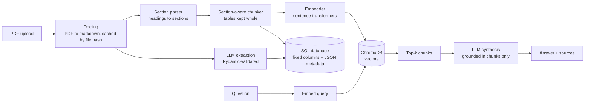

# PaperMind

A retrieval system for querying a private collection of scientific PDFs. You upload papers, it converts them to structured text with Docling, splits them into section-labelled chunks, indexes them for semantic search, extracts structured metadata with an LLM, and answers questions with citations back to the paper and section.

Status: working prototype. Ingestion, retrieval, storage, the REST API and a retrieval evaluation script are implemented. See [Limitations](#limitations) for what is not done yet.

## How it works


```mermaid
flowchart LR
    A[PDF upload] --> B[Docling<br/>PDF to markdown, cached by file hash]
    B --> C[Section parser<br/>headings to sections]
    C --> D[Section-aware chunker<br/>tables kept whole]
    D --> E[Embedder<br/>sentence-transformers]
    E --> F[(ChromaDB<br/>vectors)]
    B --> G[LLM extraction<br/>Pydantic-validated]
    G --> H[(SQL database<br/>fixed columns + JSON metadata)]
    D --> H
    Q[Question] --> I[Embed query]
    I --> F
    F --> J[Top-k chunks]
    J --> K[LLM synthesis<br/>grounded in chunks only]
    K --> L[Answer + sources]
```

Two stores are used because they answer different questions. ChromaDB answers "which passages are closest in meaning to this question". The SQL database holds one row per paper with fixed fields (title, key claim, main result) plus a JSON column for domain-specific fields.

## Design decisions

**Docling for parsing.** Scientific papers are often two-column, and naive PDF text extraction interleaves the columns. Docling handles reading order, headings and tables, and exports markdown. Parsed markdown is cached on disk by file hash so re-running the pipeline while tuning the chunker does not re-parse.

**Section-aware chunking.** Fixed-size splitting cuts across section boundaries, so one chunk can mix Methods and Results text. Here a chunk never crosses a heading. References and acknowledgements are dropped because they are citation lists.

**Tables are kept whole.** A markdown table is always a single chunk, never split or merged with prose, and the "Table N:" caption above it is attached, since the caption is what tells the embedding model what the numbers mean.

**Dynamic metadata in a JSON column.** Different fields report different quantities, so the schema cannot be fixed in advance. Fields common to all papers are real columns, and everything domain-specific goes in `extra_metadata`. The same SQLAlchemy model runs on SQLite (default, no setup) or PostgreSQL by changing `DATABASE_URL`.

**Validated LLM extraction.** LLM output is parsed and validated against a Pydantic model. On malformed output it retries once with a stricter prompt. If extraction still fails, the paper's chunks stay searchable and only the structured metadata is missing.

**Retrieval evaluated without an LLM.** `papermind/eval/evaluate.py` measures Hit Rate@k and MRR by checking whether retrieved chunks contain expected keywords. Keywords are used instead of chunk IDs because chunk IDs change whenever chunking parameters change, which is exactly what you want to tune.

**Graceful degradation.** With no LLM key configured, `/query` still returns the retrieved sources and notes that synthesis is unavailable.

## Setup

```bash
git clone https://github.com/HarshvardhanJ/papermind
cd papermind
uv sync

cp .env.example .env     # add a free GROQ_API_KEY from console.groq.com
uv run uvicorn papermind.api.main:app --reload
```

Run commands from the repository root, since data paths are relative. Open http://localhost:8000/docs for the interactive API. The first run downloads the Docling models and the `all-MiniLM-L6-v2` embedding model (about 80 MB); both are cached locally.

## API

| Method | Path | Purpose |
|---|---|---|
| POST | `/papers` | Upload and ingest a PDF (`?extract=false` skips the LLM step) |
| GET | `/papers` | List papers and ingestion status |
| GET | `/papers/{id}` | Full metadata for one paper |
| GET | `/papers/{id}/status` | Ingestion status |
| DELETE | `/papers/{id}` | Remove from both stores |
| POST | `/query` | Ask a question, get an answer with sources |
| GET | `/health` | Liveness and chunk count |

```bash
curl -F "file=@paper.pdf" http://localhost:8000/papers
curl -X POST http://localhost:8000/query \
     -H "Content-Type: application/json" \
     -d '{"question": "What response time was reported?", "top_k": 5}'
```

## Evaluation

Copy `papermind/eval/eval_set.example.json` to `eval_set.json` and write questions about the papers you ingested. Each item has a question and keywords that a correct chunk must contain:

```bash
uv run python -m papermind.eval.evaluate
```

Results on a real corpus: to be added after running against the full paper set.

## Tests

```bash
uv run pytest
```

The tests cover section parsing, chunking rules (including table handling), duplicate detection, retrieval, evaluation and the API. They run offline and need no API key, no Docling and no model download. Docling output is represented by a fixture in `tests/fixtures/`.

## Project layout

```
papermind/
  ingestion/   parser.py (Docling), sections.py, chunker.py, pipeline.py
  retrieval/   embedder.py, vector_store.py
  extraction/  schema.py, extractor.py
  query/       synthesizer.py, pipeline.py
  storage/     models.py, database.py
  api/         main.py
  eval/        evaluate.py, eval_set.example.json
  utils/       docling_client.py
prompts/       extraction.md
tests/
```

## Limitations

- Text-based PDFs only. OCR is disabled, so scanned PDFs are rejected with an error.
- Retrieval is dense semantic search only. There is no keyword (BM25) hybrid search and no reranking.
- Extracted metadata is stored but `/query` does not yet use it to filter retrieval, so a question such as "response time under 10 seconds" is answered by semantic similarity, not a numeric filter.
- Ingestion is synchronous. The `/status` endpoint exists for a future background-task version.
- Extraction truncates very long papers to fit the model context window.
- Chunks do not overlap.
- Single user, no authentication, no Docker configuration.
