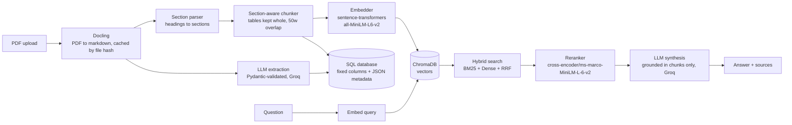

# PaperMind

A retrieval system for querying a private collection of scientific PDFs. Upload papers, ask questions, and get answers with citations back to the source paper and section.

**Status**: Working prototype with 30+ papers ingested, hybrid retrieval, reranking, and a Chainlit chat UI.

---

## How It Works


```mermaid
flowchart LR
    A[PDF upload] --> B[Docling<br/>PDF to markdown, cached by file hash]
    B --> C[Section parser<br/>headings to sections]
    C --> D[Section-aware chunker<br/>tables kept whole, 50w overlap]
    D --> E[Embedder<br/>sentence-transformers<br/>all-MiniLM-L6-v2]
    E --> F[(ChromaDB<br/>vectors)]
    B --> G[LLM extraction<br/>Pydantic-validated, Groq]
    G --> H[(SQL database<br/>fixed columns + JSON metadata)]
    D --> H
    Q[Question] --> I[Embed query]
    I --> F
    F --> J[Hybrid search<br/>BM25 + Dense + RRF]
    J --> K[Reranker<br/>cross-encoder/ms-marco-MiniLM-L-6-v2]
    K --> L[LLM synthesis<br/>grounded in chunks only, Groq]
    L --> M[Answer + sources]
```

---

## Design Decisions

### Docling for PDF Parsing
Scientific papers are often two-column; naive PDF text extraction interleaves columns. Docling handles reading order, headings, tables, and exports clean markdown. Parsed markdown is cached on disk by file hash so re-running the pipeline while tuning the chunker does not re-parse.

### Section-Aware Chunking
Fixed-size splitting cuts across section boundaries (e.g., Methods + Results in one chunk). Here a chunk never crosses a heading. References and acknowledgements are dropped because they are citation lists. **Overlap (50 words)** is added to preserve context across chunk boundaries.

### Tables Kept Whole
A markdown table is always a single chunk, never split or merged with prose. The "Table N:" caption above it is attached, since the caption tells the embedding model what the numbers mean.

### Hybrid Search (BM25 + Dense + RRF)
Pure dense search misses exact terminology. BM25 catches keyword matches. Results fused with Reciprocal Rank Fusion (RRF, k=60). BM25 index cached and invalidated on new ingestion.

### Cross-Encoder Reranking
Top 20 candidates from hybrid search re-ranked by `cross-encoder/ms-marco-MiniLM-L-6-v2`. Significantly improves precision at top ranks.

### Metadata-Filtered Retrieval
LLM extracts structured filters from the question (author, year, `extra_metadata` fields like `model_dimension`, `bleu_score`, etc.), applies them via SQL `WHERE` before semantic search. Falls back to unfiltered search if no matches.

### Dynamic Metadata in JSON Column
Different fields report different quantities. Fixed columns for common fields (title, authors, year, key_claim, main_result), domain-specific fields in `extra_metadata` (JSON). Same SQLAlchemy model runs on SQLite (dev) or PostgreSQL (prod) via `DATABASE_URL`.

### Validated LLM Extraction
LLM output parsed and validated against Pydantic model. On malformed output, retries once with stricter prompt. If extraction fails, chunks stay searchable; only structured metadata is missing.

### Graceful Degradation
With no LLM key configured, `/query` still returns retrieved sources and notes that synthesis is unavailable.

### Background Ingestion
`/papers/async` endpoint queues PDF for background worker; client polls `/papers/{id}/status`. Worker runs as daemon thread in API lifespan.

---

## Features

| Feature | Status |
|---------|--------|
| PDF upload + ingestion (Docling) | ✅ |
| Section-aware chunking with overlap | ✅ |
| Table preservation | ✅ |
| Dense vector search (ChromaDB) | ✅ |
| BM25 keyword search | ✅ |
| Hybrid search (RRF) | ✅ |
| Cross-encoder reranking | ✅ |
| Metadata-filtered retrieval | ✅ |
| LLM metadata extraction (Groq) | ✅ |
| Structured metadata in SQL | ✅ |
| Background ingestion + status polling | ✅ |
| Chainlit chat UI with persistent chat history and citation hover tips | ✅ |
| File upload panel in chat | ✅ |
| Docker + Postgres deployment | ✅ |
| Retrieval evaluation (strict/soft) | ✅ |

---

## Quick Start (Local)

```bash
git clone https://github.com/HarshvardhanJ/papermind
cd papermind

# Install dependencies
uv sync

# Add Groq API key (free at console.groq.com)
cp .env.example .env
# Edit .env: set unique generated secrets and add your GROQ_API_KEY

# Start API server
uv run uvicorn papermind.api.main:app --reload

# In another terminal, start Chainlit UI
uv run chainlit run papermind.ui.chainlit_app.py --port 8001
```

- API docs: http://localhost:8000/docs
- Chat UI: http://localhost:8001

---

## Docker Deployment

See [DEPLOY.md](DEPLOY.md) for the Oracle VM setup, required secrets, persistent storage, HTTPS via Cloudflare Tunnel, backup/restore, and a first-deploy checklist. In short: copy `.env.example` to `.env`, set unique credentials, then run `docker compose up --build -d`. The Chainlit UI and unauthenticated API are bound to localhost only; PostgreSQL and Chroma are private to the Compose network.

---

## API Endpoints

| Method | Path | Purpose |
|--------|------|---------|
| POST | `/papers` | Upload and ingest PDF synchronously (`?extract=false` skips LLM) |
| POST | `/papers/async` | Queue PDF for background ingestion |
| GET | `/papers` | List all papers + status |
| GET | `/papers/{id}` | Full metadata for one paper |
| GET | `/papers/{id}/status` | Ingestion status (for async) |
| DELETE | `/papers/{id}` | Remove from both stores |
| POST | `/query` | Ask a question, get answer with sources |
| GET | `/health` | Liveness + chunk count |

**Example:**
```bash
curl -F "file=@paper.pdf" http://localhost:8000/papers

curl -X POST http://localhost:8000/query \
  -H "Content-Type: application/json" \
  -d '{"question": "What is the BLEU score?", "top_k": 5}'
```

---

## Chainlit Chat UI

- **Citation hover tips**: Hover a source reference to preview its paper and section
- **Files panel**: Reopen the right-side panel to see uploaded papers and ingestion status
- **Chat history**: Reopen previous conversations from the left-side history bar
- **Chat history**: Persisted in separate PostgreSQL database (`chat_history.db` / `chat-db`)
- **Starter prompts**: Pre-defined questions for common queries

---

## Evaluation

```bash
# Strict mode: ALL keywords must appear in one chunk (default)
uv run python -m papermind.eval.evaluate

# Soft mode: ANY keyword in chunk (recommended for large corpus)
uv run python -m papermind.eval.evaluate --mode soft

# Custom top-k
uv run python -m papermind.eval.evaluate --mode soft -k 10
```

**Results on 30+ papers (~5000 chunks, 117 questions):**

| Mode | Hit Rate@5 | MRR |
|------|------------|-----|
| strict | 26.5% | 0.180 |
| soft | 88.0% | 0.833 |

Strict mode requires ALL expected keywords in a single chunk - too restrictive for large corpora where relevant content spans chunks. Soft mode (any keyword) better reflects real retrieval quality.

---

## Configuration

Environment variables (`.env`):

| Variable | Default | Purpose |
|----------|---------|---------|
| `GROQ_API_KEY` | required | Groq API key for LLM extraction/synthesis |
| `LLM_MODEL` | `openai/gpt-oss-120b` | Groq model name |
| `DATABASE_URL` | `sqlite:///data/papermind.db` | SQL backend (PostgreSQL for prod) |
| `CHAT_DATABASE_URL` | `sqlite:///data/chat_history.db` | Chat history DB |
| `CHROMA_PERSIST_DIR` | `data/chroma` | Vector store directory |
| `CHROMA_HOST` | unset | Optional Chroma HTTP server host; unset uses local persistent mode |
| `CHROMA_PORT` | `8000` | Chroma server port when `CHROMA_HOST` is set |
| `CHAINLIT_AUTH_SECRET` | required in Docker | Secret used to sign Chainlit sessions |
| `PAPERMIND_ADMIN_USERNAME` | required in Docker | Single Chainlit login username |
| `PAPERMIND_ADMIN_PASSWORD` | required in Docker | Single Chainlit login password |
| `POSTGRES_USER` | `postgres` | PostgreSQL user for both databases |
| `POSTGRES_PASSWORD` | required in Docker | URL-safe (hex) PostgreSQL password |

---

## Project Layout

```
papermind/
├── api/
│   └── main.py              # FastAPI endpoints
├── ingestion/
│   ├── parser.py            # Docling PDF → markdown (cached)
│   ├── sections.py          # Markdown → section parsing
│   ├── chunker.py           # Section-aware chunking + overlap
│   ├── pipeline.py          # Ingestion orchestration
│   └── background_worker.py # Async ingestion worker
├── retrieval/
│   ├── embedder.py          # all-MiniLM-L6-v2 wrapper
│   ├── vector_store.py      # ChromaDB interface
│   ├── hybrid_search.py     # BM25 + dense + RRF
│   └── reranker.py          # Cross-encoder reranking
├── extraction/
│   ├── schema.py            # Pydantic extraction schema
│   └── extractor.py         # Groq LLM extraction + retry
├── query/
│   ├── pipeline.py          # Filters → hybrid → rerank → synthesis
│   ├── filters.py           # LLM-based query filter extraction
│   └── synthesizer.py       # Answer synthesis with citations
├── storage/
│   ├── models.py            # SQLAlchemy models (Paper, ChunkRecord)
│   └── database.py          # DB connection + session
├── ui/
│   ├── chainlit_app.py      # Chainlit entry point
│   ├── chat_db.py           # Chat session/message/file models
│   ├── auth.py              # Auth callback
│   └── components/
│       ├── citations.py     # Side-panel citation formatting
│       └── file_upload.py   # Upload handling
├── eval/
│   ├── evaluate.py          # Retrieval evaluation (strict/soft)
│   └── eval_set.json        # 117 questions for 30+ papers
├── utils/
│   └── docling_client.py    # Singleton Docling converter
prompts/
└── extraction.md            # Extraction system prompt
```

---

## Why These Choices?

| Decision | Rationale |
|----------|-----------|
| **Docling** | Handles two-column layouts, reading order, tables; exports markdown |
| **Section-aware chunking** | Prevents mixing Methods/Results; overlap preserves context |
| **ChromaDB** | Lightweight, embedded vector store; good for <100k chunks |
| **BM25 + RRF** | Dense search misses exact terms; keyword + semantic = better recall |
| **Cross-encoder reranker** | Cheap re-ranking of top 20; large quality gain |
| **Metadata filtering** | Turns "response time < 10s" into SQL filter, not semantic guess |
| **JSON `extra_metadata`** | Different fields report different quantities; schema-free |
| **Groq** | Free tier generous; OpenAI-compatible structured output |
| **Separate chat DB** | Keeps chat history isolated from paper metadata |
| **Background worker** | Avoids blocking uploads; status polling via existing `/status` |
| **Chainlit** | Purpose-built for LLM chat apps; side panels, file upload, auth |

---

## Limitations

- Text-based PDFs only. OCR disabled (scanned PDFs rejected).
- Retrieval is hybrid search only. No learned sparse (SPLADE) or query expansion yet.
- Extraction truncates very long papers to fit model context window.
- Single user, no multi-tenancy or RBAC.
- SQLite for dev; Postgres required for production concurrency.

---

## License

MIT License. See LICENSE file for details.
